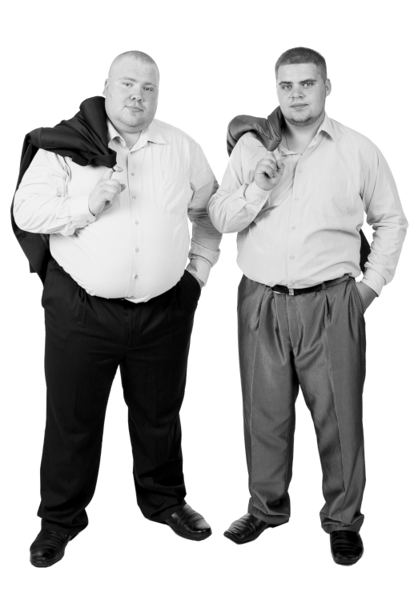

# Fat Slob Plumbing

I'm a lucky guy!

As a solo freelance dev, it's not easy to get hired by a world-class business!

That's why I'm **honoured** to have been hired by [**Fat Slob Plumbing**](https://fat-slob-plumbing.vercel.app/) to build their website.

Ron & Dave are on a mission to save humanity from the horror of a blocked toilet.

Meanwhile, I'm on a mission to leverage TypeScript, Next.js, React, GraphQL, and pure CSS to produce the best website possible for Fat Slob Plumbing.

Business is booming - they're franchising!

## React

- Just about everything's a React component
- HTML sections, customer & partner cards, typography, you name it. Even spacers

## Pure CSS

- responsive design
- _cascading_ styles, which respect HMTL semantics
- set global styles, make exceptions further down the hierarchy as required

## TypeScript

- strict: true
- noImplicitAnys: true 

# To Do:

- bookings with "Trish"

- Maps of available franchises

- e-commerce: Fat Slob Plumbing t-shirts

- logo

- Twitter account, bot, feed, etc

## Contributing

Thank you for considering contributing to the Fat Slob Plumbing code-base!

## Code of Conduct

In order to ensure that the Fat Slob Plumbing community is welcoming to all, please be pleasant and well-mannered.

## Security Vulnerabilities

If you discover a security vulnerability in the Fat Slob Plumbing code, please raise an issue. All security vulnerabilities will be promptly addressed.

## License

Fat Slob Plumbing is open-sourced software licensed under the [MIT license](https://opensource.org/licenses/MIT).
